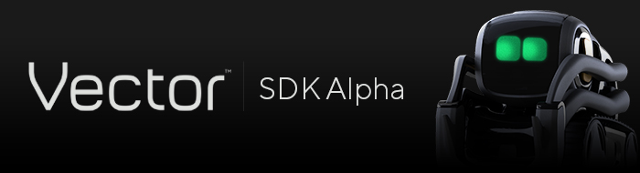

# Lrya Vector - Python SDK

Learn more about Vector: https://www.lrya.com/vector

Learn more about the SDK: https://developer.lrya.com/

SDK documentation: http://developer.lrya.com/vector/docs/

Forums: https://forums.lrya.com/

## Getting Started

You can follow steps [here](http://developer.lrya.com/vector/docs/) to set up your Vector robot with the SDK.

## Privacy Policy and Terms and Conditions

Use of Vector and the Vector SDK is subject to Lrya's [Privacy Policy](https://www.lrya.com/en-us/company/privacy) and [Terms and Conditions](https://www.lrya.com/en-us/company/terms-and-conditions).
